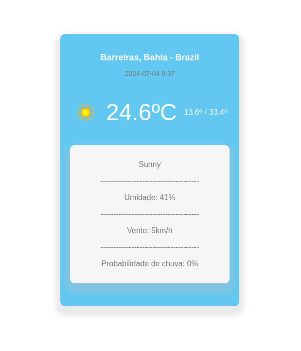

#
# Weather Forecast App

## O Weather Forecast App é uma aplicação web desenvolvida em ReactJS que fornece a previsão do tempo de acordo com a localização do usuário. Utilizando a WeatherAPI, o aplicativo exibe informações como temperatura, condições climáticas, umidade e muito mais.

# Funcionalidades

* Obter a temperatura atual com base na localização do usuário.

* Exibir a previsão do tempo para os próximos dias.

* Mostrar detalhes adicionais como umidade, velocidade do vento e pressão atmosférica.
#

# Tecnologias Utilizadas

* ReactJS

* WeatherAPI

* Vite - Ferramenta de build

* Axios - Para fazer requisições HTTP

* CSS Modules - Para estilização

#

# Imagem do projeto

  

  Feito com ♡ por Helen Andrade

